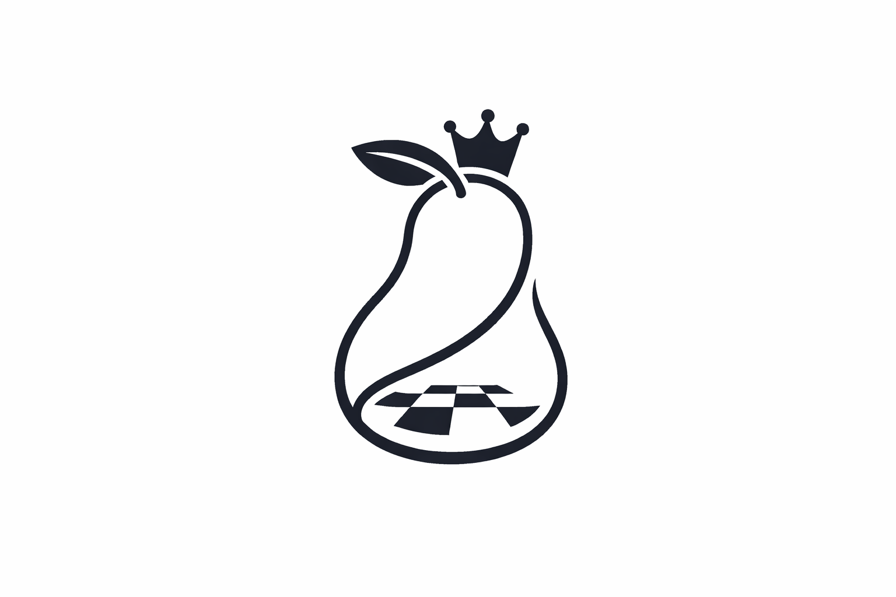

  <h1>tochess</h1>
  
<em>A self-learning AI chess model exploring how computers learn from scratch.</em>

  

    <!--  -->
     
    
  

---

**Motivation:** The primary goal of this project is to build a self-learning chess agent from scratch. Instead of hard-coding chess strategies or training the model on datasets of human matches, we want to observe how a machine learning algorithm develops its own logic purely through trial and error. This project serves as a practical exploration of how a model evolves from making random moves to discovering complex strategies entirely on its own via self-play.

## 🔬 Methodology & Architecture (Upcoming)
As a scientific exploration, transparency in *how* the model learns is as important as the results. In the upcoming phases, this section will detail:
* **State Representation:** How the board is mathematically represented to the neural network.
* **Learning Algorithm:** The specific Reinforcement Learning architecture (e.g., Q-Learning, PPO, or MCTS) utilized for self-play.
* **Training Metrics:** Alongside Elo, we will track and publish raw loss curves and reward convergence graphs to scientifically validate the learning process.

## 📈 Curriculum Learning & Performance Tracking
To objectively measure the model's progress, it starts with an absolute baseline rating of **0 Elo**. The model's growth is managed through a strict "Curriculum Learning" pipeline. It must achieve a certain Elo threshold to unlock the next tier of opponents:

* **Tier 1 (0 - 200 Elo):** Plays against **Random Agent**.
* **Tier 2 (200 - 400 Elo):** Plays against **Greedy Agent** (Always captures).
* **Tier 3 (400 - 800 Elo):** Plays against **Simple Heuristic Agent** (Basic piece value logic).
* **Tier 4 (800 - 1400+ Elo):** Plays against **Maia Chess** (Human-like neural network) and restricted **Stockfish** engines.

*The daily progress and Elo changes are automatically tracked and visualized in a chart.*

## 📝 Changelog / Releases

### `[v0.0.1] - In Development (Current)`
* **Added:** Project initialization.
* **Planned:** Visual chess board (UI) and core environment setup.

---

## 🚀 Project Status

* **✅ Completed:** 
  * Project initialization.
* **🔄 In Progress:** 
  * Setting up the visual chess board (UI) and core environment.
  * Implementing core chess logic and legal move generation.
* **📋 Backlog:** * 
  * Build the baseline benchmark agents.
  * Build the self-play mechanism and data collection.
  * Implement automated Elo chart generation.
* **🐛 Known Issues:** *No bugs reported yet.*

---

## 📚 Current Research & Readings

## 🔗 References & Literature

## ❤️ Contribution & Support
This project is entirely an educational endeavor. I created it out of pure curiosity to deeply understand how artificial intelligence and machine learning work under the hood. 

If you find this journey interesting, want to contribute to the code, or simply want to support the project, leaving a ⭐ on the repository would make me very happy and motivated!